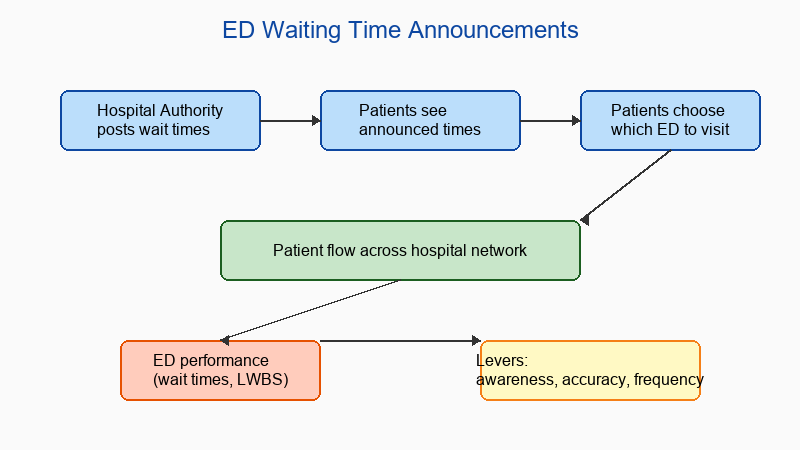

## What this paper is about

Many emergency departments publish expected waiting times to help patients choose where to seek care. Using over 1.3 million patient visits to Hong Kong public EDs, this study estimates how many patients actually respond to these announcements and how sensitive they are to the reported times. The findings inform the design of announcement systems that can reduce waiting times and the number of patients who leave without being seen.

