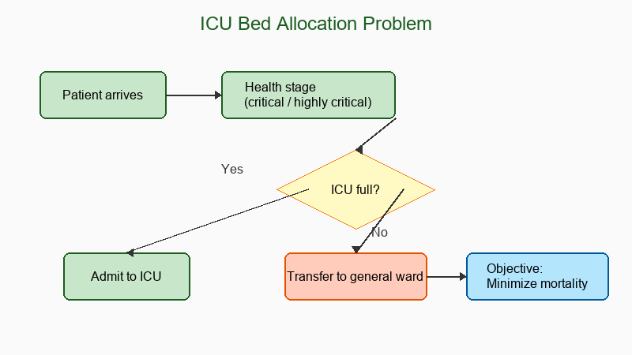

## What this paper is about

When an intensive care unit (ICU) runs out of beds during a surge, hospitals must decide whether to admit a new patient to the ICU or transfer an existing patient to a general ward. This paper develops a Markov-chain model of patient health evolution and proposes admission/transfer policies that minimize the long-run mortality rate.

